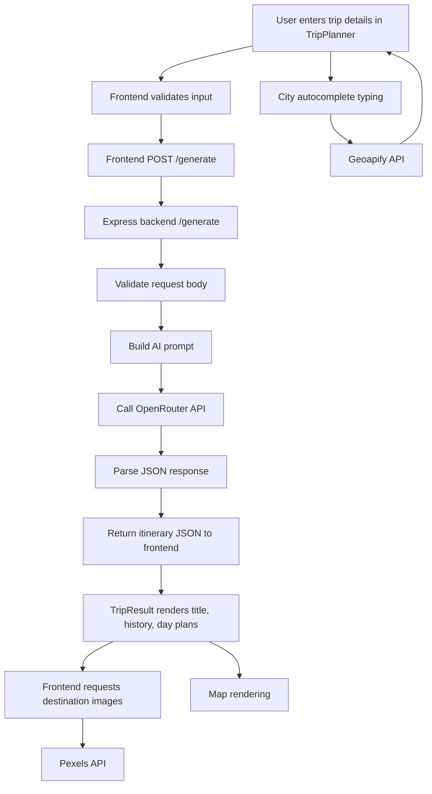

# Tripnexa

Tripnexa is an AI-powered trip planner with a React frontend and an Express backend.
It takes user travel preferences, generates a day-wise itinerary using OpenRouter, and enriches the UI with city autocomplete and destination images.

## Tech Stack

- Frontend: React (`ai-travel-agent`)
- Backend: Node.js + Express (`backend`)
- AI provider: OpenRouter chat completions
- Places autocomplete: Geoapify
- Images: Pexels (with fallback image URLs)

## Data Flow

## Environment Variables

### Frontend (`ai-travel-agent/.env`)

- `REACT_APP_GEOAPIFY_KEY` - Geoapify API key for city autocomplete
- `REACT_APP_PEXELS_KEY` - Pexels API key for destination images
- `REACT_APP_API_URL` (optional) - API base URL for production

### Backend (`backend/.env`)

- `OPENROUTER_API_KEY` - OpenRouter API key for itinerary generation
- `CORS_ORIGINS` - Allowed frontend origins
- `PORT` (optional) - Backend port (default is `8000`)

## Run Locally

1. Start backend:
   - `cd backend`
   - `npm install`
   - `npm run dev`
2. Start frontend:
   - `cd ai-travel-agent`
   - `npm install`
   - `npm start`

Default local URLs:

- Frontend: `http://localhost:3000`
- Backend: `http://127.0.0.1:8000`
